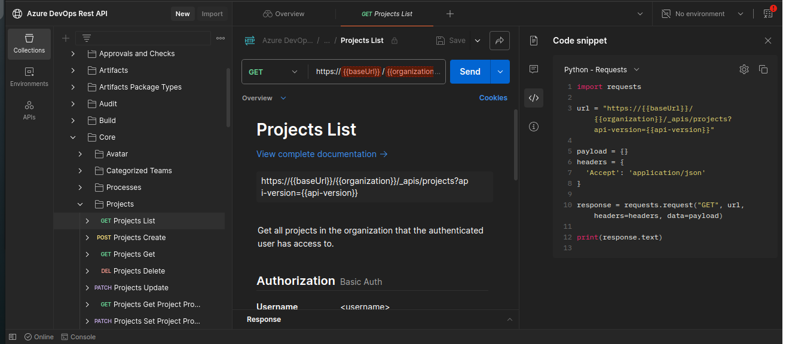

# How to run the Azure Devops REST Api using Python. 

### Pre-Request. 
1. Generate PAT token for making the REST Api calls. 
2. Fill the details in env.txt and rename to .env 
```
pat="AABBCCDD" # PAT Token generated in Step 1 
baseURL="dev.azure.com" # Default 
org="AABBCCDD" # Your ORG name 
project="AABBCCDD" # Azure Devops Project name you working on 
apiversion="7.1" # Api version 
```

### Steps:
1. Refer [PostMan URL](https://www.postman.com/azurearchitecture/azure-devops-rest-api/folder/4b7g6be/security) OR [Azure DevOps REST API](https://learn.microsoft.com/en-us/rest/api/azure/devops/?view=azure-devops-rest-7.2#create-the-request) documentation . 
2. Select Services you want to manage via REST API
    ex: To get list of azure devops projects , use Core Services. 
3. Select Operation you want to perform . 
    ex: To get the list of azure devops projects , use projects/GET operations . 

4. Note down the HTTP Operation URL. 
ex:
```
GET https://dev.azure.com/{organization}/_apis/projects/{projectId}?api-version=7.2-preview.4
```
5. If you using POSTMAN select code view and use python requests. 

6. Create python function using this code . 
7. 
